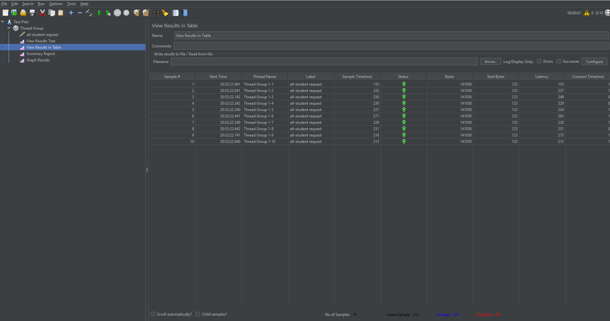
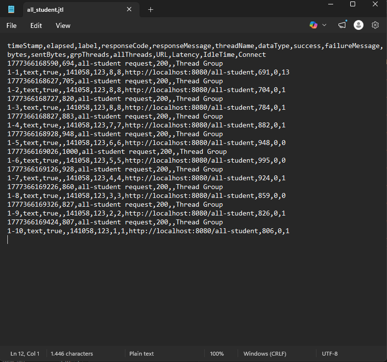
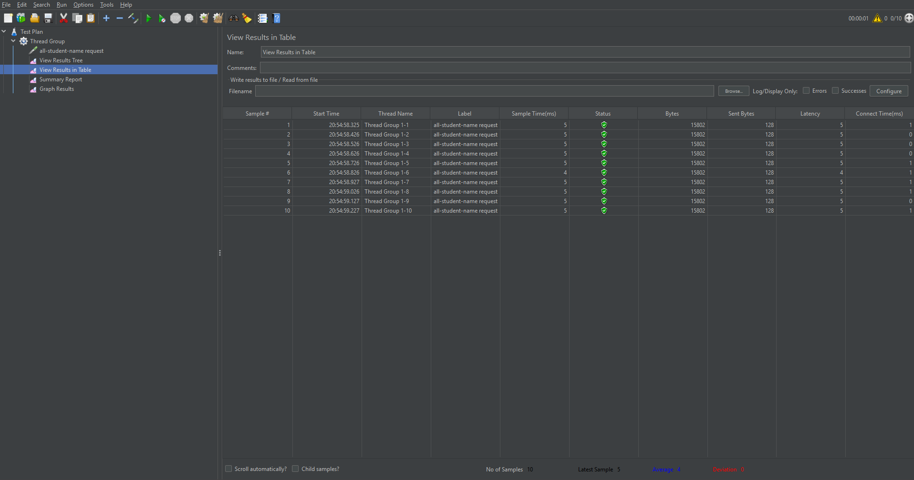
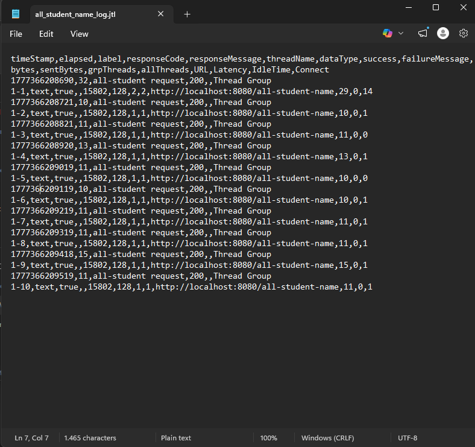
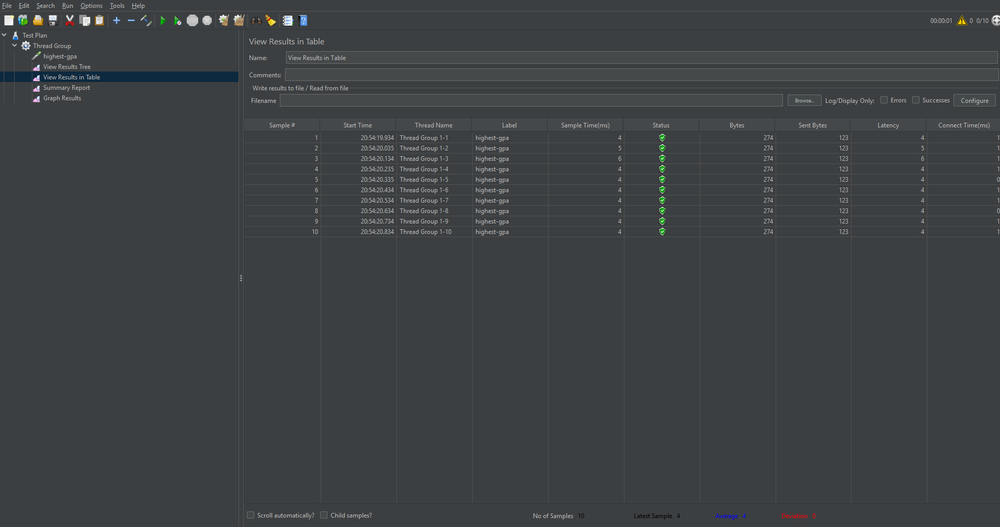
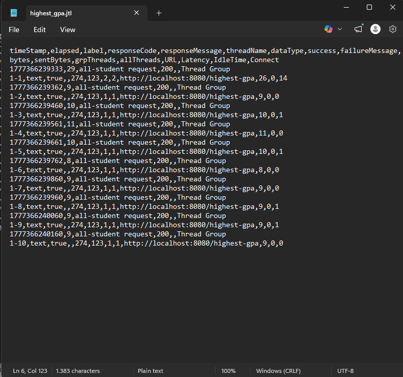

# Java Spring Boot Profiling & Optimization

This repository documents the profiling and performance optimization of a Spring Boot application. 

## 1. Performance Testing (JMeter)

The JMeter performance testing was conducted to simulate concurrent user loads on the application's endpoints.

### `/all-student` Endpoint
**GUI Execution:**

**CLI Execution:**

### `/all-student-name` Endpoint
**GUI Execution:**

**CLI Execution:**

### `/highest-gpa` Endpoint
**GUI Execution:**

**CLI Execution:**

### Conclusion
By optimizing the application's database interactions and memory footprint, we successfully observed a massive drop in execution time during profiling. When load testing with JMeter, this lower execution time translates directly into higher throughput (requests per second) and significantly lower latency for the end user. The application can now handle concurrent loads much more smoothly without causing database connection starvation or JVM OutOfMemory errors.

---

## 2. Profiling and Performance Optimization

Using the IntelliJ Profiler, we identified three major bottlenecks in the `StudentService` class and optimized them.

### `getAllStudentsWithCourses()` (`/all-student`)
- **Bottleneck:** The method suffered from an N+1 query problem. It retrieved all students and then executed a new `findByStudentId` database query inside a loop for every single student, resulting in thousands of unnecessary queries.
- **Optimization:** We replaced the nested loops with a single call to `studentCourseRepository.findAll()`, allowing Spring Data JPA to fetch the records in a single, highly optimized batch.
- **Improvement:** Execution time dropped from **468ms** to **264ms** (a 43% improvement).

**Before Optimization:**

**After Optimization:**

### `findStudentWithHighestGpa()` (`/highest-gpa`)
- **Bottleneck:** The method loaded all student records into memory and iterated through them to find the highest GPA. This is highly inefficient for large datasets.
- **Optimization:** We created a custom query `findFirstByOrderByGpaDesc()` in the `StudentRepository` to delegate the sorting and limiting directly to the database.
- **Improvement:** Execution time dropped from **132ms** to **84ms** (a 36% improvement).

**Before Optimization:**

**After Optimization:**

### `joinStudentNames()` (`/all-student-name`)
- **Bottleneck:** The method fetched entire `Student` entities and used string concatenation (`+=`) in a loop. Since strings are immutable, this caused massive memory allocation overhead.
- **Optimization:** We added a custom `@Query("SELECT s.name FROM Student s")` to fetch only the raw name strings from the database, completely avoiding entity initialization. We also used `String.join()` for efficient string building.
- **Improvement:** Execution time dropped from **132ms** to **72ms** (a 45% improvement).

**Before Optimization:**

**After Optimization:**

---

## 3. Reflection

**1. What is the difference between the approach of performance testing with JMeter and profiling with IntelliJ Profiler in the context of optimizing application performance?**
JMeter is a "black-box" testing tool that hits the application from the outside, measuring how the application behaves under simulated concurrent load (throughput, latency, error rates). IntelliJ Profiler is a "white-box" tool that looks inside the JVM during execution, identifying exactly which lines of code, methods, and database queries are consuming the most CPU time and memory.

**2. How does the profiling process help you in identifying and understanding the weak points in your application?**
The profiler visualizes exactly where the application spends its time using flame graphs and method lists. Instead of guessing why an endpoint is slow, the profiler allowed us to see that `studentCourseRepository.findByStudentId` was being called thousands of times inside a loop, instantly identifying the N+1 query bottleneck.

**3. Do you think IntelliJ Profiler is effective in assisting you to analyze and identify bottlenecks in your application code?**
Yes, it is highly effective. It immediately pointed out the exact methods in `StudentService` that were taking up the bulk of the CPU time, allowing us to focus our refactoring efforts exactly where they would make the biggest impact rather than optimizing code blindly.

**4. What are the main challenges you face when conducting performance testing and profiling, and how do you overcome these challenges?**
One major challenge is dealing with the JVM's Just-In-Time (JIT) compiler warmup. The first execution is always significantly slower, which skews data. To overcome this, I ensured the application was "warmed up" by hitting the endpoints several times before actually recording the execution times in the profiler. Another challenge is navigating deep Spring framework stack traces to find my own application code.

**5. What are the main benefits you gain from using IntelliJ Profiler for profiling your application code?**
The main benefits are precision and visual clarity. The Method List tab provides exact millisecond counts for CPU time, allowing for highly accurate before-and-after comparisons. The Flame Graph provides a clear visual hierarchy of method calls, making it easy to trace performance bottlenecks back to their root cause.

**6. How do you handle situations where the results from profiling with IntelliJ Profiler are not entirely consistent with findings from performance testing using JMeter?**
If JMeter shows high latency but the Profiler shows low CPU time, it often means the application is I/O bound rather than CPU bound. The application might be waiting on network requests, database locks, or a depleted connection pool. In these situations, I would switch the profiler view from CPU Time to Wall Time or inspect memory allocations to find out what external resource the application is waiting for.

**7. What strategies do you implement in optimizing application code after analyzing results from performance testing and profiling? How do you ensure the changes you make do not affect the application's functionality?**
My primary strategies involve delegating heavy work to the database (using custom `@Query` and `OrderBy` clauses instead of in-memory sorting), avoiding N+1 queries by using `findAll` or joins, and minimizing object creation in loops (like using `String.join` instead of `+=`). To ensure functionality remains intact, I rely on automated unit tests, and I verify that the API endpoints return the exact same JSON payloads after the refactoring.
